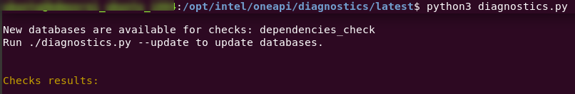

.. _diagnose:

===============================
ERROR, FAIL, and WARNING Status
===============================

Checks listed at the top of the list have higher priority and may have
dependent checks further down the list. When diagnosing problems, start by
troubleshooting the checks at the top of the list.

The output shows these items:

+-------------------+--------------------------------------------------------------------------------------------------------+
| **Check Name**    | Name of the  **check**  that ran.                                                                      |
+-------------------+--------------------------------------------------------------------------------------------------------+
| **Description**   | A brief description of what information the  **check** is reporting.                                   |
+-------------------+--------------------------------------------------------------------------------------------------------+
| **Result status** | | **PASS**  - the  **check**  found the expected result.                                               |
|                   | | **FAIL**  -  **check**  ran successfully but the  **check** found a problem with the expected result.|
|                   | | **WARNING**  -  **check**  ran successfully and but found incompatible or incorrect information.     |
|                   | | **ERROR**  -  **check**  was not able to run. See below for possible causes.                         |
+-------------------+--------------------------------------------------------------------------------------------------------+

Examples of **Result Status**

- [+] **PASS**  - If the check was to find information such as a version number,
  a passing check will display that information.

- [-] **FAIL**  - If the check was to run a GPU check on a system that does not
  have a GPU, the check will fail and the description will indicate that the
  GPU is not present.

- /!\\ **WARNING**  -  If the check successfully runs, but can't parse the
  incompatible or incomplete result, there will be a warning with a
  brief description as to why the information is incomplete or incompatible.

- (-) **ERROR**  -  check was not able to run. Possible causes:
    - current user does not have permissions to access information that
      the check is looking for such as a driver version,
      but the driver is not accessible to the current user.
    - software or hardware is not initialized.

.. _update-db:

----------------------------
Updating the Checks Database
----------------------------

Before troubleshooting a check, first ensure that the checks database is up
to date with the latest version. Updating to the latest version will provide
updates to output messages that may give you more detail about why a check
has a status of ERROR or FAIL.

To update the database, run the  ``--update`` argument:

.. code-block:: python

  python3 diagnostics.py --update

-----------------------
Resolving Failed Checks
-----------------------

A status of FAIL indicates that the check ran successfully but the result of
the check does not meet the expected requirements. The table below shows the
expected result and how to fix the problem.

For example, running  ``python3 diagnostics.py --select user_group_check  intel_gpu_detector_check``
may produce this output:

.. _status:

::

  Checks results:

  ======================================================================================================================
  Check name: intel_gpu_detector_check
  Description: This check shows which Intel GPU(s) is on the system based on lspci information and internal table.
  Result status: PASS
  ======================================================================================================================

  ======================================================================================================================
  Check name: user_group_check
  Description: This check verifies that the current user is in the same group as the GPU(s).
  Result status: FAIL
  Current user is not part of the video group, contact the system administrator to add current user to the video group.
  ======================================================================================================================

  2 CHECKS, 1 PASS, 1 FAIL, 0 WARNINGS, 0 ERRORS

  Console output file: /home/test/intel/diagnostics/logs/diagnostics_select_intel_gpu_detector_check_hostname_20211123_103132327319.txt
  JSON output file: /home/test/intel/diagnostics/logs/diagnostics_select_intel_gpu_detector_check_hostname_20211123_103132327361.json

  The report was generated for the machine: hostname
  by the Diagnostics Utility for Intel® oneAPI Toolkits 2022.1.0

  Result status: FAIL
  Current user is not part of the video group, to add a user: sudo usermod -a -G video test.

In this case, the output gives a possible solution to fix the failed check.

The table below shows likely solutions for a failed status for each available
check:

+-----------------------------+----------------------------------------------------------------------------------------------------------------------------------------------------+
|      Check that Failed      |                                                                 Possible Solution                                                                  |
+=============================+====================================================================================================================================================+
| gpu_backend_check           | OpenCL or LevelZero Driver is not loaded. Load the driver.                                                                                         |
|                             | Current user may not have permissions to access driver folder. Try running as  ``sudo``                                                            |
+-----------------------------+----------------------------------------------------------------------------------------------------------------------------------------------------+
| oneapi_app_check            | Information only. If a oneapi is found, the check will INFO. If a oneAPI component is not found, the check will ERROR.                             |
+-----------------------------+----------------------------------------------------------------------------------------------------------------------------------------------------+
| driver_compatibility_check  | Check drivers to ensure they are compatible with installed oneAPI components.                                                                      |
+-----------------------------+----------------------------------------------------------------------------------------------------------------------------------------------------+
| gcc_compiler_check          | GCC compiler is not installed.                                                                                                                     |
+-----------------------------+----------------------------------------------------------------------------------------------------------------------------------------------------+
| intel_gpu_detector_check    | Information only. If a gpu is found, the check will PASS. If a gpu is not found, the check will FAIL.                                              |
+-----------------------------+----------------------------------------------------------------------------------------------------------------------------------------------------+
| base_system_check           | Information only. If a system information is found, the check will PASS. If system information is not found, the check will ERROR.                 |
+-----------------------------+----------------------------------------------------------------------------------------------------------------------------------------------------+
| hangcheck_check             | Hangcheck is currently enabled. Disable hangcheck to get this check to PASS.                                                                       |
+-----------------------------+----------------------------------------------------------------------------------------------------------------------------------------------------+
| user_group_check            | Current user is not a part of the same group as the GPU. Add current user to the video group with the command  ``sudo usermod -a -G video test`` . |
+-----------------------------+----------------------------------------------------------------------------------------------------------------------------------------------------+
| oneapi_env_check            |                                                                                                                                                    |
+-----------------------------+----------------------------------------------------------------------------------------------------------------------------------------------------+
| kernel_options_check        | Information only. If a system information is found, the check will PASS. If system information is not found, the check will ERROR.                 |
+-----------------------------+----------------------------------------------------------------------------------------------------------------------------------------------------+
| gpu_metrics_check           |                                                                                                                                                    |
+-----------------------------+----------------------------------------------------------------------------------------------------------------------------------------------------+
| oneapi_gpu_check            | Check was not able to run workloads on the GPU. Try running as sudo. If sudo does not work, GPU is not ready to run workloads.                     |
+-----------------------------+----------------------------------------------------------------------------------------------------------------------------------------------------+
| user_resources_limits_check |                                                                                                                                                    |
+-----------------------------+----------------------------------------------------------------------------------------------------------------------------------------------------+

When running a group of checks, you may have multiple failures simultaneously.
Fixing one failure could potentially fix other failures, depending on their
relationship.

.. <!--how will the user know if the fails were fixed?-->
   <is the setenv script the same thing as setvars?>

 If all FAILs were fixed and you still have and issue, try to fix ERRORs.
 First, try to run Diag tool with administrative privileges and check that you
 have setup setenv script from oneAPI.

 <if all checks pass, why are they reporting to a forum?>

 If all checks passed, please collect all logs: run
 “python3 diagnostics.py --select all”, find full log
 into $HOME/intel/diagnostics/logs (by default) and report issue to forum <link> .

