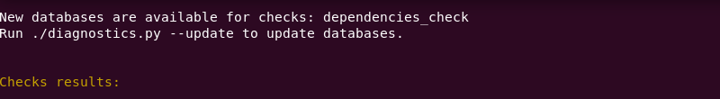

.. _diagnose:

=========================================
Resolving ERROR, FAIL, and WARNING Status
=========================================

The output shows these items:

**Check Name** : Name of the  **check**  that ran.

**Description** : A brief description of what information the  **check**
is reporting.

**Result status** : A brief description of what information the  **check**
is reporting:

- **PASS**  - the  **check**  found the expected result. If the check was
  to find information such as a version number, that information will be
  displayed.
- **FAILED**  -  **check**  ran successfully but the  **check**
  found a problem with the expected result. For example, if a GPU check
  is run on a system that does not
  have a GPU, the check will fail. A brief description will indicate why the
  check failed.
- **WARNING**  -  **check**  ran successfully and but found incompatible
  or incorrect information. A brief description will indicate why.

- **ERROR**  -  **check**  was not able to run. Possible causes:
    - current user does not have permissions to access information that
      the check is looking for. (Exmaple: check is looking for driver version,
      but the driver is not accessible to the
      current user)
    - software or hardware is not initialized

.. _update-db:

----------------------------
Updating the Checks Database
----------------------------

Before troubleshooting a check, first ensure that the checks database is up
to date with the latest version. Updating to the latest version will provide
updates to output messages that may give you more detail about why a check
has a status of ERROR or FAIL.

When running a check, a message will appear if the database needs to be
updated:

To update the database, run the  ``--update`` argument:

.. code-block:: python

  python3 diagnostics.py --update

-----------------------
Resolving Failed Checks
-----------------------

A status of FAIL indicates that the check ran successfully but the result of
the check does not meet the expected requirements. The table below shows the
expected result and how to fix the problem.

For example, running  ``python3 diagnositcs.py --filter intel_gpu_check``
may produce this output:

.. _status:

::

  ==============================================================================
  Check name: intel_gpu_check
  Description : Detect which Intel GPU is on the system.
  Result status: FAIL
  Unable to get information about initialized devices because the user doesn't have read access to /sys/kernel/debug/dri/.
  =============================================================================================================================================================================================================

  1 CHECKS, 0 PASSED, 1 FAILED, 0 WARNING, 0 ERROR

  Console output file: /home/test/intel/diagnostics/diagnostics_nnladtldev-01_20210831-141156.txt
  JSON output file: /home/test/intel/diagnostics/diagnostics_nnladtldev-01_20210831-141156.json
  ===============================================================================

  Result status: FAIL
  Current user is not part of the video group, to add a user: sudo usermod -a -G video test.

In this case, the output gives a possible solution to fix the failed check.

The table below shows likely solutions for a failed status for each available
check:

+-----------------------------+----------------------------------------------------------------------------------------------------------------------------------------------------+
|      Check that Failed      |                                                                 Possible Solution                                                                  |
+=============================+====================================================================================================================================================+
| oneapi_app_check            | Information only. If a oneapi is found, the check will PASS. If a oneAPI component is not found, the check will ERROR.                             |
+-----------------------------+----------------------------------------------------------------------------------------------------------------------------------------------------+
| gpu_backend_check           | OpenCL or LevelZero Driver is not loaded. Load the driver.                                                                                         |
|                             | Current user may not have permissions to access driver folder. Try running as  ``sudo``                                                            |
+-----------------------------+----------------------------------------------------------------------------------------------------------------------------------------------------+
| vtune_check                 | VTune is not installed.                                                                                                                            |
|                             | Current user may not have access to VTune folder. Try running as  ``sudo``                                                                         |
+-----------------------------+----------------------------------------------------------------------------------------------------------------------------------------------------+
| gcc_version_check           | GCC compiler is not installed.                                                                                                                     |
+-----------------------------+----------------------------------------------------------------------------------------------------------------------------------------------------+
| intel_gpu_detector_check    | Information only. If a gpu is found, the check will PASS. If a gpu is not found, the check will ERROR.                                             |
+-----------------------------+----------------------------------------------------------------------------------------------------------------------------------------------------+
| base_system_check           | Information only. If a system information is found, the check will PASS. If system information is not found, the check will ERROR.                 |
+-----------------------------+----------------------------------------------------------------------------------------------------------------------------------------------------+
| hangcheck_check             | Hangcheck is currently enabled. Disable hangcheck to get this check to PASS.                                                                       |
+-----------------------------+----------------------------------------------------------------------------------------------------------------------------------------------------+
| user_group_check            | Current user is not a part of the same group as the GPU. Add current user to the video group with the command  ``sudo usermod -a -G video test`` . |
+-----------------------------+----------------------------------------------------------------------------------------------------------------------------------------------------+
| kernel_boot_options_check   | Information only. If a system information is found, the check will PASS. If system information is not found, the check will ERROR.                 |
+-----------------------------+----------------------------------------------------------------------------------------------------------------------------------------------------+
| gpu_metrics_check           |                                                                                                                                                    |
+-----------------------------+----------------------------------------------------------------------------------------------------------------------------------------------------+
| oneapi_gpu_check            | Check was not able to run workloads on the GPU. Try running as sudo. If sudo does not work, GPU is not ready to run workloads.                     |
+-----------------------------+----------------------------------------------------------------------------------------------------------------------------------------------------+
| advisor_check               |                                                                                                                                                    |
+-----------------------------+----------------------------------------------------------------------------------------------------------------------------------------------------+
| user_resources_limits_check |                                                                                                                                                    |
+-----------------------------+----------------------------------------------------------------------------------------------------------------------------------------------------+

When running a group of checks, you may have multiple failures simultaneously.
Fixing one failure could potentially fix other failures, depending on their
relationship.

.. <!--how will the user know if the fails were fixed?-->
   <is the setenv script the same thing as setvars?>

 If all FAILs were fixed and you still have and issue, try to fix ERRORs.
 First, try to run Diag tool with administrative privileges and check that you
 have setup setenv script from oneAPI.

 <if all checks pass, why are they reporting to a forum?>

 If all checks passed, please collect all logs: run
 “python3 diagnostics.py --filter all”, find full log
 into $HOME/intel/diagnostics (by default) and report issue to forum <link> .

-----------------------------------
Resolving Dependency Error Messages
-----------------------------------

If you run a single check and this error message appears:

``The results of the required check
dependencies were not received before running the corresponding check.``

This means that another check that needs to be run first. To troubleshoot this
problem, run a group of checks that includes the check you want.

For example, if the  ``oneapi_app_check``  is run using this command:

  ``python3 diagnostics.py --filter oneapi_app_check``

If the  ``required check dependencies``  message appears, look at the
:ref:``List of Checks by Check Name<check-table>`` to determine what groups
contain ``oneapi_app_check`` .
In this case, the check
is included in several different groups, but we will use the ``compile`` group:

  ``python3 diagnostics.py --filter compile``

This time, the check will give more details about dependencies. In this
case, the dependency is on the Level Zero driver, which did not get checked
when it was only the  ``oneapi_app_check``  being run.

::

 Checks results:

 ===============================================================================
 Check name: oneapi_app_check
 Description : This check shows version information of installed oneAPI
 products.
 Result status: ERROR
 There is no information about Level Zero driver.
 ===============================================================================
