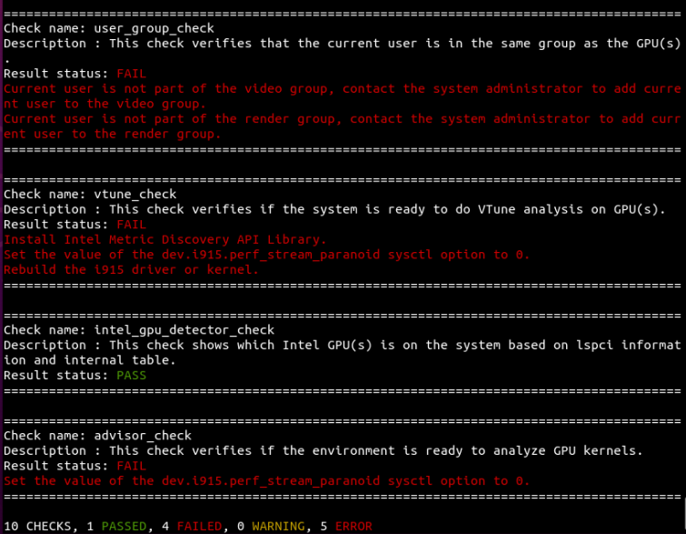

.. _group-checks:

=====================
Run a Group of Checks
=====================

The Diagnostics Utility for oneAPI organizes checks in groups or categories.
To choose specific group you want to run, use the List of Checks.

For example, use the  ``gpu``  argument to run multiple checks related
to GPU hardware and
software. The  ``gpu``  argument will output these details:

- OpenCL and LevelZero driver details
- Identify if VTune\ :superscript:`TM` Analyzer is ready to do analysis on GPUs
- Identify Intel GPUs on this system
- State of hangcheck option: enabled or disabled
- Identify if the current user is in the same group as the GPU(s)
- GPU metrics
- Identify if GPU is ready to run applications
- Identify if environment is ready to analyze GPU kernels

To run the utility with the  ``gpu``  argument:

::

  Linux: python3 diagnostics.py --select gpu
  Windows: diagnostics.bat --select gpu

You will see a result similar to this:

The information in the output indicates that a GPU was present, but does not
provide any more information about the GPU or how many GPUs are present.
To get more information, use ``-v`` to activate verbose mode:

 ::

  python3 diagnostics.py --select gpu -v

The output will contain expanded details for each check. In the example below,
the  ``intel_gpu_detector_check`` shows what information the Diagnostics Utility
for oneAPI found.

Verbosity can be customized to output different levels of details. To learn
more, see :ref:`Verbose Mode Options <verbosity>`.

To see a full list of available groups, enter
``python3 diagnostics.py --list`` in your terminal, or see
:ref:`List of Checks by Group Name <check-table-by-group>`.