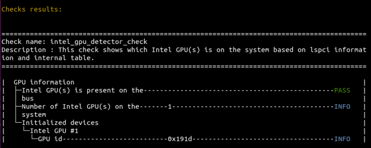

.. _single-check:

==================
Run a Single Check
==================

Instead of running multiple checks with one argument, you may want to run
a single check to only show the status of one diagnostic check.

To run a check to find out which Intel GPUs are on this system, use the
``intel_gpu_detector_check`` argument:

 ::

  python3 diagnostics.py --filter intel_gpu_detector_check

You will see output similar to this:

.. image:: images/gpu-single-check.png
  :width: 800
  :alt: Output from single check for gpu

The information in the output indicates that a GPU was present, but does not
provide any more information about the GPU or how many GPUs are present.
To get more information, use ``-v`` to activate verbose mode:

 ::

  python3 diagnostics.py --filter intel_gpu_detector_check -v

You will see output similar to this:

Verbosity can be customized to output different levels of details. To learn
more, see :ref:`Verbose Mode Options <verbosity>`.

To see a full list of available checks, enter
``python3 diagnostics.py --list`` in your terminal, or see
:ref:`List of Checks by Check Name <check-table>`.