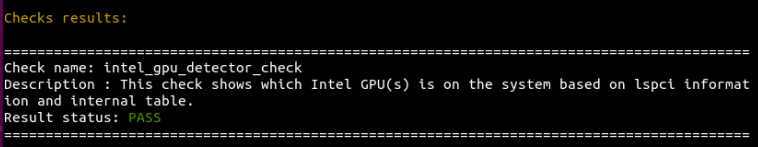
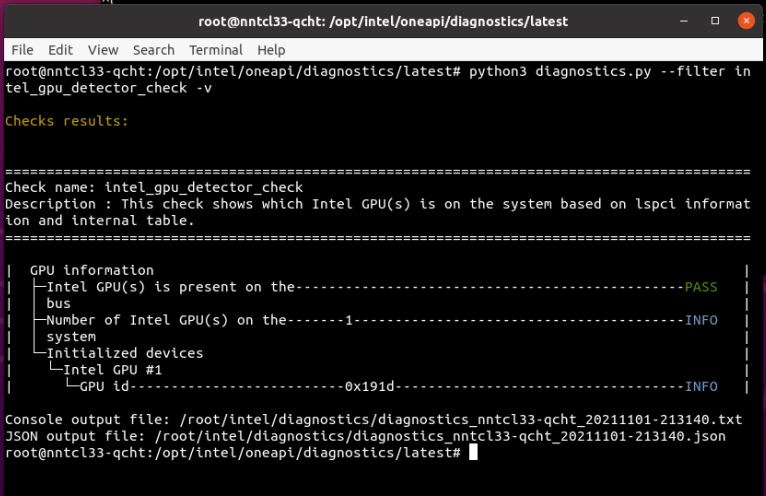

.. _verbosity:

====================
Verbose Mode Options
====================

The Diagnostics Utility for oneAPI has six verbosity
levels to add more detail in the output of each check:

.. _verbosity-levels:

.. list-table:: Verbosity Levels
   :header-rows: 0

   * - Without -v argument
     - Print the information about running, successful,
       and failed checks with information about errors and critical errors.
   * - With -v argument - verbosity level 0:
     - Print the default checks with information about warnings.
   * - With -vv argument - verbosity level 1
     - Print more detailed checks information about info logging.
   * - With -vvv argument - verbosity level 2
     - Print more detailed checks information.
   * - With -vvvv argument - verbosity level 3
     - Print more detailed checks information.
   * - With -vvvvv argument - verbosity level 4
     - Print the most detailed checks information with debug information.

Note: The JSON file with the results of launched checks always contains
the maximum amount of verbose information.

Without the -v argument, the minimum level of detail will be output.
For example:

 ::

  python3 diagnostics.py --select intel_gpu_detector_check

You will see output similar to this:

To increase the amount of detail in your output, add the -v argument.
For example:

 ::

  python3 diagnostics.py --select intel_gpu_detector_check -v

You will see output similar to this:

